# 重置、排版、代码

## 重置
* 在Bootstrap3中虽然已经存在,但是没有像Bootstrap4中有文档说明
* 重置的原因
  - 更新部分浏览器的预设值,在可变动的文字间距上使用rem代替em
  - 避免margin-top垂直边缘可能发生重叠,产生无法预料的错误,更重要的是margin应该是单向,简单的思维
  - 为了设备之间轻松缩放,block元素应当在margin上采用rem
  - 尽可能使用继承将字体相关属性的声明保持在最低限度

* 引入Bootstrap4的CSS文件后,会对一些元素的样式进行重置或者增加一些预设值,下面就一一介绍
  - Bootstarp通过:root给html标签上声明变量,格式```--变量名: 变量值```,并将所有标签、伪元素都变成怪异盒模型```*, ::after, ::before : { box-sizing: border-box; }```提供给html标签内元素使用
    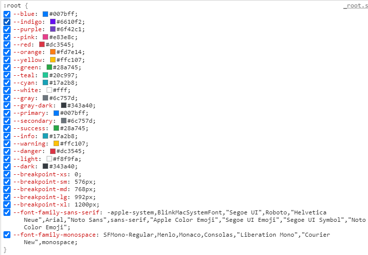
  - 如何使用html标签声明的变量
    ```
    <div class="testval"></div>

    .testval{
        width: 100px;
        height: 100px;
        background: var(--blue);
    }
    ```
  - body标签的样式重置
    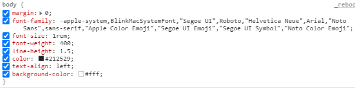
  - 标题和段落的样式重置
    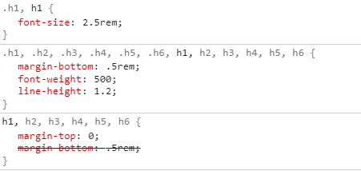
    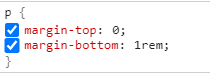
  - 列表标签的样式重置  
    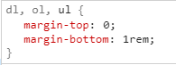
    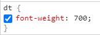
    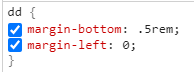  
    **细节：其中li标签里面能嵌套ul标签,嵌套的ul标签的margin-bottom为0**
  - pre标签的样式重置(通常标签的内容里面的空格不会显示在页面,而在pre标签的内容里面的空格可以正常显示)
    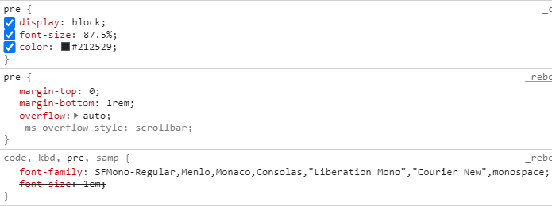
  - table标签的样式重置  
    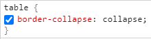
    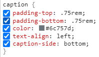  
    **table标签中除了caption标签(table标签中的标题标签)从表格头被放到表格尾,其他基本没有变化**
  - 表单标签的样式重置  
    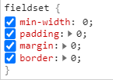
    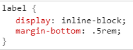
    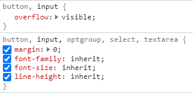
    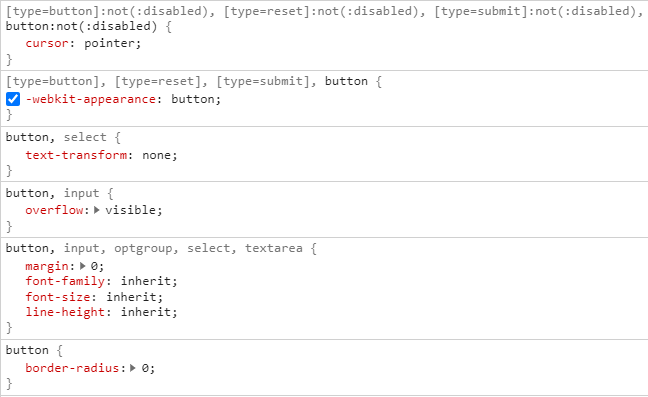
    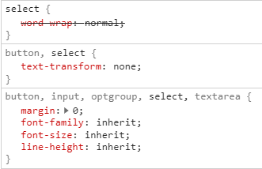
    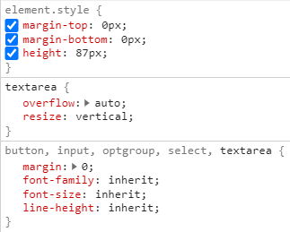  
* 上面展示的标签为常用标签,还有其他一些标签可以参考官方文档

## 排版
  - 标题  
  
  - 提供标题的相应类名
  ```
    <h1>陈学辉</h1>
    <h2>陈学辉</h2>
    <h3>陈学辉</h3>
    <h4>陈学辉</h4>
    <h5>陈学辉</h5>
    <h6>陈学辉</h6>
    <p class="h1">陈学辉</p>
    <p class="h2">陈学辉</p>
    <p class="h3">陈学辉</p>
    <p class="h4">陈学辉</p>
    <p class="h5">陈学辉</p>
    <p class="h6">陈学辉</p>
  ```
  - 定制标题样式(标题里面还提供一个small标签来设置副标题)
  ```
    <h3>
      这是一个标题
      <small class="text-muted">这是一个副标题</small>
    </h3>
  ```
  - 超大标题(通过给标题添加display-1到display-4之间的类名)
  ```
    <h1>陈学辉</h1>
    <h1 class="display-1">陈学辉</h1>
    <h1 class="display-2">陈学辉</h1>
    <h1 class="display-3">陈学辉</h1>
    <h1 class="display-4">陈学辉</h1>
  ```
  - 引言(通过给标签添加.lead来添加引言内容,字体比标题小一些,但比段落大)
  ```
    <p class="lead">我们的宗旨是为人民服务</p>
    <p>我们的宗旨是为人民服务</p>
  ```
  - 内联文本
  ```
    <p>你可以使用mark标签来标记<mark>重点</mark>词汇</p>
    <!-- Bootstrap3中有u标签和s标签显示效果和del和ins标签一样,但尽量不要使用u和s标签，虽然Bootsrap4中也有,但是还是使用del和ins代替效果都一样,u和s标签后面会被淘汰的 -->
    <p><del>这是一段被删除的文本</del><ins>这是一段新插入进去的文本</ins></p>
    <p><small>这段文本的字体会小</small></p>
    <p><strong>这里是加粗的文本</strong></p>
    <p><em>这里是倾斜的文本</em></p>
    <p><span class="mark">用.mark代替mark标签,</span><span class="small">用.small代替small标签</span></p>
  ```
  - 缩写
  ```
    <p><abbr title="attribute">attr</abbr></p>
    <!-- 类名initialism可以让字体变得小一点 -->
    <p><abbr title="HypperText Markup Language" class="initialism">HTML</abbr></p>
  ```
  - 引用和署名
  ```
    <blockquote class="blockquote">
      <p>时间就像海绵里的水,只要愿挤,总还是有的</p>
      <footer class="blockquote-footer">
          来自
          <cite title="Source Title">鲁迅</cite>
      </footer>
    </blockquote>
  ```
  - 对齐(通过给元素添加类名text-center、text-left和text-right,默认值text-left)
  ```
    <p class="text-center">不知道为什么,每次过安检的时候过不去,好郁闷!为什么?因为他们说,我的心里装了一个你!</p>
    <p class="text-left">不知道为什么,每次过安检的时候过不去,好郁闷!为什么?因为他们说,我的心里装了一个你!</p>
    <p class="text-right">不知道为什么,每次过安检的时候过不去,好郁闷!为什么?因为他们说,我的心里装了一个你!</p>
  ```
  - 列表
    - 无特效列表
    ```
    <!-- 清除li的list-style样式 -->
    <ul class="list-unstyled">
      <li>red</li>
      <li>
        <!-- li标签嵌套列表外部ul设置的样式失效,需要重新给嵌套的ul标签添加 -->
        <ul class="list-unstyled">
          <li>blue</li>
        </ul>
      </li>
    </ul>
    ```
    - 行内列表
    ```
    <!-- list-inline配合list-inline-item让ul标签里面所有li都在一行 -->
    <ul class="list-inline">
      <!-- Bootstrap3的版本是不需要在li身上添加list-inline-item,只要ul有list-inline,ul标签内所有li都在一行 -->
      <li class="list-inline-item">red</li>
      <li class="list-inline-item">blue</li>
      <li class="list-inline-item">green</li>
    </ul>
    ```
    - 描述内容的对齐
    ```
    <!-- 结合栅格系统实现左边是标题,右边是详细解释;实现标题和解析在不同尺寸屏幕显示不同样式 -->
    <div class="container-fluid">
        <dl class="row">
            <!-- text-truncate类名让超出的内容省略,使用...替换;在Bootstrap3的版本里使用的是text-overflow -->
            <dt class="col-sm-3 text-truncate">矮,矮得不要不要得,矮得不要不要得</dt>
            <dd class="col-sm-9">矮，汉语常用字，读作ǎi，最早见于秦代小篆，其本义是身材短，即《说文解字》：“矮，短人也。”后引申为低、不高的、等级地位低、卑下的等义。</dd>
        </dl>
    </div>
    ```

## 代码
  - 行内代码(通过code标签可以给转义的标签添加颜色)
  ```
  <p>我要在这段文本里写一个<code>&lt;section&gt;</code>的html标签</p>
  ```
  - 大段引用(通常有一些博客,网站里面显示再一个范围内显示一段代码超出部分还有滚动条使用的就是pre标签)
  ```
  <pre class="pre-scrollable">
    <code>
        &lt;h1&gt;这是一个标签&lt;/h1&gt;
        &lt;p&gt;这是一段文字&lt;/p&gt;
        &lt;p&gt;这些代码放在code里,再放到pre标签里,给pre标签添加一个pre-scrollable的class,就会显示成一个340px高的框,超过后就会出现滚动条&lt;/p&gt;
    </code>
  </pre>
  ```
  - 变量(使用<var>标记变量)
  ```
  <var>y</var> = <var>m</var><var>x</var> + <var>b</var>
  ```
  - 按钮(使用<kbd>来标记键盘上的按钮,看起来跟生动)
  ```
  <p>想要保存的话,请按下<kbd>ctrl</kbd>+<kbd>s</kbd></p>
  ```
  - 输出(使用<samp>标签没什么用)